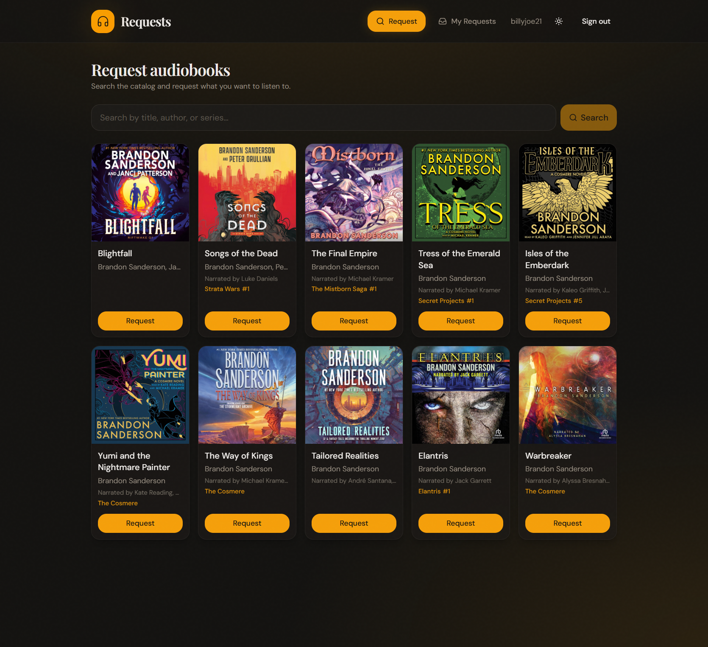

import { Steps } from '@astrojs/starlight/components';

**narratorr-requests** is an [Overseerr](https://overseerr.dev/)-style request manager for
[narratorr](/). Family and friends sign in, search the audiobook catalog, and request titles;
an admin approves them, and approved requests are handed to narratorr's `search → download →
import` pipeline. It's the "let other people ask for audiobooks without giving them the keys to
narratorr" layer.

## How it fits with narratorr

narratorr-requests is a **plug-in sidecar**. It talks to narratorr **only** over narratorr's
public `/api/v1` HTTP surface, authenticated with a narratorr **API key**. There is no other
coupling — no shared database, no shared filesystem.

- The **API key is server-to-server only.** It lives in narratorr-requests's backend and is
  never sent to the browser. The browser only ever calls narratorr-requests's own `/api/*`.
- narratorr-requests **polls** narratorr (`GET /books/:id`) to follow a request's progress — there
  is no webhook back from narratorr.
- You configure the narratorr connection (and your notifiers) in narratorr-requests's own
  in-app **Settings** page after first boot — not through environment variables.

:::note
You need a **running narratorr instance and an API key** for it (narratorr → Settings → API).
Until that connection is configured, search and requests return a "not connected yet" notice.
:::

## The request flow

<Steps>

1. **Sign in.** A user signs in with local email/password or an OIDC provider (Plex bridge,
   Authelia, etc. — see [Authentication](/narratorr-requests/authentication/)).

2. **Get approved.** New users land in an **approval queue** (`pending`) and can't search or
   request until an admin approves them. The first user to sign in becomes the admin.

3. **Search & request.** An approved user searches the catalog and hits **Request** on a result.
   Each result shows whether the book is already in your library, already on the way, or
   requestable.

4. **Admin approves the request.** The admin approves (or denies) each request from the **Queue**.
   Admins and any users flagged *auto-approve* skip this step.

5. **Handoff to narratorr.** On approval, narratorr-requests adds the book to narratorr (idempotent
   by ASIN) and the request enters `acquiring`.

6. **Track to available.** narratorr-requests polls narratorr and advances the request to
   `available` once narratorr finishes importing. The requester watches this **live on their My
   Requests page** — it updates every few seconds.

</Steps>

:::note[Notifications are admin-facing]
narratorr-requests notifies the **admin** of a new request to review, a new user awaiting
approval, and a request that failed to acquire — over any notifiers you add (ntfy, email, Discord,
Slack, Telegram, Pushover, Gotify, or a generic webhook). It does **not** notify the requester when
their book becomes available — requesters follow status on their **My Requests** page. (A
requester-facing "your book is ready" notification is planned for a future release.)
:::

## Authentication vs. authorization

These are independent on purpose:

- **Authentication** (who you are) is **pluggable** — local email/password, any number of OIDC
  providers, or an `AUTH_BYPASS` dev shortcut.
- **Authorization** (who may request) is the in-app **approval queue** — `pending` → `active` /
  `rejected`, decided by an admin.

So you can let anyone sign in via your IdP while still gatekeeping who actually gets to request.

## Next steps

- [Installation](/narratorr-requests/installation/) — run it with Docker.
- [Authentication](/narratorr-requests/authentication/) — local and OIDC sign-in, the approval
  queue, and admin bootstrap.
- [Configuration](/narratorr-requests/configuration/) — connect to narratorr and set up
  notifications in the Settings page.
- [Using narratorr-requests](/narratorr-requests/using/) — search, request, and manage the queue.
- [Troubleshooting](/narratorr-requests/troubleshooting/) — common first-run issues.
